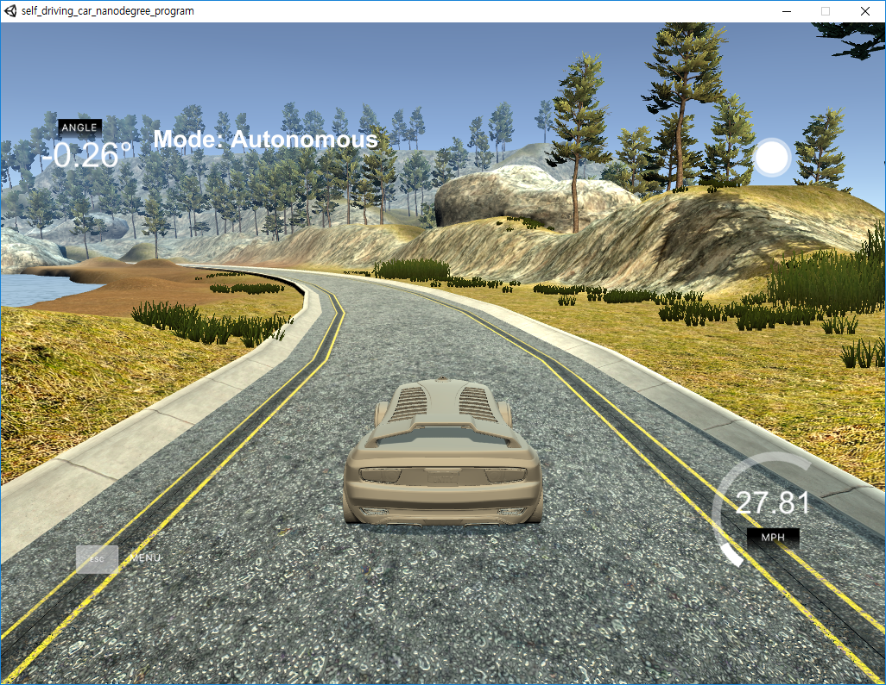

# **PID Control**

## Goals
* Keep the center of the road with PID control

## Files
* README.md: this file
* CMakeLists.txt: cmake list file
* cmakepatch.txt: cmake patch file
* install-*.sh: scripts for installing uWebSockets
* images/*: captured image file(s) for this markdown file
* src/*: source code to calculate steer_value with PID control

## Prerequisites
* cmake &ge; 3.5
* make &ge; 4.1 (Linux, Mac), 3.8 (Windows)
* gcc/g++ &ge; 5.4
* uWebSocketIO from [here](https://github.com/uNetworking/uWebSockets)
* *simulator* from [here](https://github.com/udacity/self-driving-car-sim/releases/)

## Test Method
0. run install-*.sh for installing uWebSockets library
1. In the shell prompt, type **cmake**
2. Then type **make**
3. Run **./pid**
4. Run simulator from another shell or file explorer!!
5. Select project 4

## Result
#### Tuned values
  - Kp = -0.5
  - Ki = -0.005
  - Kd = -15
